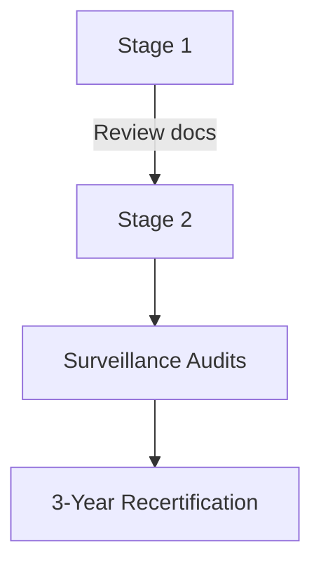

#  ISO 27001-Based Security Audit and Assessment

## Overview
This project outlines a comprehensive ISO 27001 audit for Lake Dale Contact Centre (LDCC), including audit questions, non-conformity reports, and a junior auditor guidebook. The goal is to help LDCC establish an effective Information Security Management System (ISMS) aligned with ISO 27001 standards.

## Key Components

### 1. Audit Interview Questions
15 targeted questions assessing LDCC's incident management process at strategic, tactical, and operational levels. Mapped to ISO 27001:2022 and ISO 27002:2022 controls.

**Example Questions:**
- *Strategic:* "How does the overall incident management align with LDCC's strategic mission?" (Clause 5.2)
- *Tactical:* "How often are incident response plans tested and updated?" (Annex A 5.24)
- *Operational:* "Describe how security events get reported by LDCC personnel." (Annex A 6.8)

### 2. Non-Conformity Reports (NCR)
The section outlines three non-conformity reports based on a review of LDCC's case study. Each report identifies areas where the organization’s Information Security Management System (ISMS) does not meet the requirements of ISO/IEC 27001:2022 and the related controls in ISO/IEC 27002:2022. The findings are structured using the R.E.D. (Requirement, Evidence, Deficiency) format to ensure clarity and traceability. The goal is to highlight key weaknesses in LDCC’s ISMS and support corrective actions for improvement.:

1. **Performance Analysis Gaps**  
   - *Requirement:* Clause 9.1 (ISMS performance evaluation)  
   - *Evidence:* "No comment" conclusions in D38 document  
   - *Deficiency:* Missed improvement opportunities  

2. **Incomplete Audit Program**  
   - *Requirement:* Clause 9.2 (internal audits)  
   - *Evidence:* Missing audits for risk assessment in D39  
   - *Deficiency:* Inadequate ISMS assessment  

3. **Visitor Management Issues**  
   - *Requirement:* Clause 8.1 (operational controls)  
   - *Evidence:* Missing "time out" records in D28  
   - *Deficiency:* Unauthorized access risks
     
**Example NCR:**
Non-Conformity Report for the “Performance Analysis and Evaluation (Extract) - D38 - Issue 2” Document – Page 151:

| Field | Details |
| ----- | ------- |
| **Company** | LDCC (Lake Dale Contact Centre) |
| **Report Number** | NCR-LDCC-001 |
| **Name of Auditor** | Emmanuel Ateji |
| **ISO 27001:2022 Clause Number** | Clause 9.1, 10.1 |
| **ISO 27002:2022 Annex Control** | A.5.36 |
| **Date of Audit** | 08/05/2024 |
| **Category** | Major non-conformity |
| **Non-Conformity Description** | LDCC's Performance Analysis and Evaluation (Extract) - D38 - Issue 2 document demonstrates a lack of proper analysis and evaluation of monitored ISMS performance data. Several items are marked as "?" for their most recent status, and key controls lack depth of analysis, with "No comment" listed under Conclusion. |
| **Requirement** | • ISO 27001:2022 Clause 9.1 requires the organization to evaluate the information security performance and effectiveness of the ISMS. • ISO 27001:2022 Clause 10.1 requires the organization to continually improve the suitability, adequacy, and effectiveness of the ISMS. • ISO 27002:2022 Annex Control A.5.36 requires compliance with the organization's information security policy, topic-specific policies, rules and standards to be regularly reviewed. |
| **Evidence** | Performance Analysis and Evaluation (Extract) - D38 - Issue 2 document, showing: • Several performance monitoring items marked as "?" for their most recent status. • Items related to key controls like Legal, Resources, Physical Protection, Passwords, and Media Protection have "No comment" listed under Conclusion. |
| **Deficiency of the system** | The lack of proper analysis and evaluation of ISMS performance data indicates that LDCC is not effectively assessing the suitability, adequacy, and effectiveness of their ISMS as required by ISO 27001. Without thorough reviews, LDCC may miss opportunities for improvement and fail to identify and address potential weaknesses in their ISMS. |
| **Recommendation** | LDCC (Lake Dale Contact Centre) should take the following steps: 1. Ensure all monitored performance data is properly collected and updated in a timely manner. [ISO 27001:2022 Clause 9.1, ISO 27002:2022 Annex Control A.5.36]. 2. Conduct thorough analysis of the performance data, particularly for key controls, and document meaningful conclusions and recommendations. [ISO 27001:2022 Clause 9.1, 10.1, ISO 27002:2022 Annex Control A.5.36]. 3. Use the analysis results to drive continual improvement of the ISMS, addressing any identified weaknesses or areas for enhancement. [ISO 27001:2022 Clause 10.1]. 4. Regularly review and update the Performance Analysis and Evaluation process to ensure it remains suitable and effective for assessing ISMS performance. [ISO 27001:2022 Clause 9.1, 10.1, ISO 27002:2022 Annex Control A.5.36]. |
     
### 3. Junior Auditor Guidebook
**Summary:**

The *Junior Auditor Guidebook* is designed to help new auditors understand the essential concepts, stages, and requirements of an ISO 27001 audit. It aims to build the competencies needed to effectively participate in auditing an Information Security Management System (ISMS). The guidebook references key standards—**ISO/IEC 27001:2022**, **ISO 19011:2018**, and **ISO/IEC 17021-1:2015**—to promote consistent, reliable, and high-quality audits. By following its guidance, junior auditors will be well-equipped to support audit teams and contribute meaningfully to the ISMS assessment process.
#### Audit Stages:
- **Stage 1:** Documentation review and readiness assessment  
- **Stage 2:** On-site implementation evaluation  

#### Key Concepts:
- **Auditor Competencies:** Knowledge, analytical skills, communication  
- **Objective Evidence:** Verifiable data (e.g., asset registers, logs)  
- **Mandatory Documents:** Scope, policy, risk assessments  

## Visual Summary
### Audit Process Flow

### Auditor Competencies Table

| **Name** | **Role** | **Responsibility** | **Competence (Knowledge, Skills, Personal Attributes)** | **Applicable ISO 27001** | **Applicable ISO 17021** |
|----------|----------|--------------------|---------------------------------------------------------|--------------------------|--------------------------|
| Clive Prichard | IS Manager/Management representative | Ensuring the ISMS conforms to ISO 27001 requirements | - Knowledge of ISMS, ISO 27001, and LDCC's processes. - Leadership and communication skills - Objective and impartial. | Clause 5.3 | Clause 5.2, 7.1.2, 7.2.8 |
| Gordon Black | Controls Manager/ISMS Auditor | Planning and conducting ISMS audits, reporting to the ISF | - Knowledge of ISO 27001, auditing techniques, and LDCC's ISMS. - Analytical and observational skills. - Ethical and detail-oriented. | Clause 9.2 | Clause 7.1.2, 7.2.2, 7.2.3, 7.2.4, 7.2.5, Annex A |
| Fay Woodward | Team Leader/ISMS Auditor | Assisting in ISMS audits, reporting to the Controls Manager | - Knowledge of ISO 27001, LDCC's ISMS, and auditing methods. - Communication and interpersonal skills. - Professional and adaptable | Clause 9.2 | Clause 7.1.2, 7.2.2, 7.2.3, 7.2.4, 7.2.5, Annex A |

## Recommendations
1. Address non-conformities with corrective actions  
2. Regular internal audits covering all critical areas  
3. Maintain complete records (visitor logs, backups)  

## References
- ISO 27001:2022 Standard  
- LDCC Case Study Documents  

---

## Full Project Documentation
For comprehensive details, please refer to the [complete documentation](link-to-pdf).
