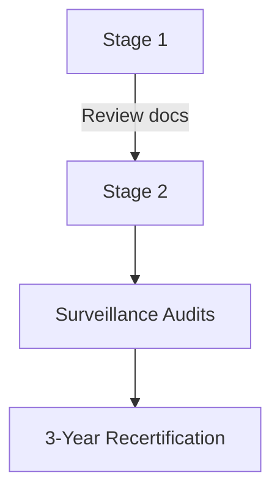

#  ISO 27001-Based Security Audit and Assessment

## Overview
This project outlines a comprehensive ISO 27001 audit for Lake Dale Contact Centre (LDCC), including audit questions, non-conformity reports, and a junior auditor guidebook. The goal is to help LDCC establish an effective Information Security Management System (ISMS) aligned with ISO 27001 standards.

## Key Components

### 1. Audit Interview Questions
15 targeted questions assessing LDCC's incident management process at strategic, tactical, and operational levels. Mapped to ISO 27001:2022 and ISO 27002:2022 controls.

**Example Questions:**
- *Strategic:* "How does incident management align with LDCC's strategic mission?" (Clause 5.2)
- *Tactical:* "How often are incident response plans tested and updated?" (Annex A 5.24)
- *Operational:* "Describe how security events get reported by personnel." (Annex A 6.8)

### 2. Non-Conformity Reports
Three major findings with R.E.D. (Requirement, Evidence, Deficiency) analysis:

1. **Performance Analysis Gaps**  
   - *Requirement:* Clause 9.1 (ISMS performance evaluation)  
   - *Evidence:* "No comment" conclusions in D38 document  
   - *Deficiency:* Missed improvement opportunities  

2. **Incomplete Audit Program**  
   - *Requirement:* Clause 9.2 (internal audits)  
   - *Evidence:* Missing audits for risk assessment in D39  
   - *Deficiency:* Inadequate ISMS assessment  

3. **Visitor Management Issues**  
   - *Requirement:* Clause 8.1 (operational controls)  
   - *Evidence:* Missing "time out" records in D28  
   - *Deficiency:* Unauthorized access risks  

### 3. Junior Auditor Guidebook
#### Audit Stages:
- **Stage 1:** Documentation review and readiness assessment  
- **Stage 2:** On-site implementation evaluation  

#### Key Concepts:
- **Auditor Competencies:** Knowledge, analytical skills, communication  
- **Objective Evidence:** Verifiable data (e.g., asset registers, logs)  
- **Mandatory Documents:** Scope, policy, risk assessments  

## Visual Summary
### Audit Process Flow

### Auditor Competencies Table
| Role | Key Skills | ISO Reference |
|------|-----------|---------------|
| Lead Auditor | Leadership, ISO knowledge | Clause 7.2.3 |
| IT Auditor | Technical controls expertise | Clause 8.1 |

## Recommendations
1. Address non-conformities with corrective actions  
2. Regular internal audits covering all critical areas  
3. Maintain complete records (visitor logs, backups)  

## References
- ISO 27001:2022 Standard  
- LDCC Case Study Documents  

---

**Note:** For full details, refer to the [original PDF](33043543_Emmanuel_SBSAAA_2024.pdf). This README summarizes key points while preserving critical information through tables, lists, and diagrams. For GitHub, consider splitting lengthy sections into separate markdown files linked from the main README.
